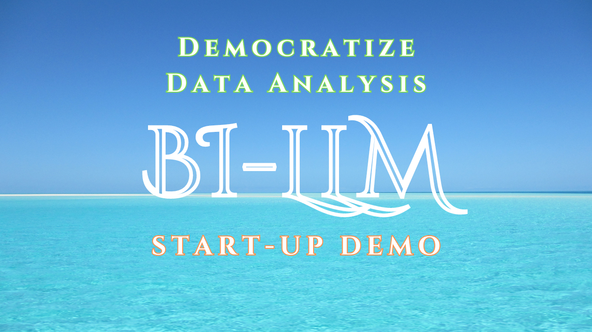
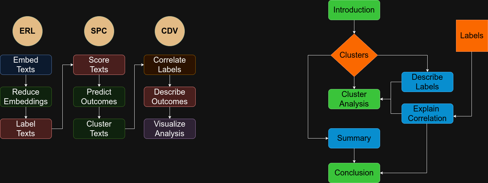

# BI-LLM

*Democratize data analysis*

[](https://youtu.be/RoLU_REypyY)

BI-LLM automates data analysis workflows using LLMs, and machine learning methods. 

It is web-native, fully-developed on Typescript. It also runs locally, powered by Ollama, and requires no advanced knowledge of data science.

BI-LLM labels texts, and groups them by similarity. Then, it uses the labels to generate a report that explains certain outcome. The report can be used to inform decisions, draft an email, setup a meeting, or kickstart a formal analysis around specific questions. 

The image on the left shows the data processing pipeline. The image on the right the prompting sequence that leads to the report. 



A sample of the report generated can be found in the `docs/demos` folder. You can see a demo of the proyect in [YouTube](https://youtu.be/RoLU_REypyY).


## Getting Started

### Prerequisites
* Ollama running on port `11434`
* Typescript and `ts-node`
* Create a `lib/config.json` based on `lib/config.example.json`
* JSON data file with the following structure:
```json
[
  {
    "text": "One of many texts to be labeled",
    "output": "The outcome we are interested in predicting or explaining"
  }
]
```
### Start the analysis
Navigate to directory: `cd lib/pipelines`

Install dependencies: `npm install`

Run the analysis: `ts-node index.ts`

### Visualize the results

Navigate to app directory: `cd app`

Install dependencies: `npm install`

Start react app: `npm run dev`

## Roadmap

On October 2024, a hosted version of the web app will be made available powered by a library and components, and likely [web-llm](https://github.com/mlc-ai/web-llm). 

Development-wise the focus will be on improving the quality of analysis via: 

1. RAG integration: this will allow to perform recurrent analysis, incorporating learnings from the past.

2. Multiagent analysis: increase the sophistication of the report with a multiagent setting, benefiting from a variety of perspectives. Inspired from [Enhancing Anomaly Detection in Financial Markets with an LLM-based Multi-Agent Framework
](https://arxiv.org/abs/2403.19735)

3. Federated learning: enable a setting were inference capabilities become more accurate, and efficient by aggregating insights from different analysis, while mantaining privacy of data.  

Industry-wise the focus will be on building tooling for the investing (seed stage) community, and social media (LinkedIn & YouTube). 

Go-to-market strategy based on data-journalism sharing insights on important questions powered by data.

## Contributing

If you are interested in contributing, please open a GitHub issue. If possible, including artifacts of the analysis you've ran, and what details on what would you like to improve, or add.

If you are a startup, or open-source project, and would like to explore integrations: I would love to hear from you. Please also open an issue to explore the possibility. So far, I've explored possible integrations with (Hammming)[https://hamming.ai/] for meta-prompting, and RAG evaluation, and with (Murnitur)[https://murnitur.ai/#features] for observability. [GuardrailsAI](https://www.guardrailsai.com/) is another good option. 

Lastly, if you are an investor, I would also like to hear from you. Today, I'm part-time on this, and with your help the project can turn into a startup. The idea is to focus on the development of the technology for 1 or 2 years, and later focus on enterprise features that enable collaboration, and governance at scale. The intention is to keep the project open, and fully-functional for individual users, and even small teams. 

Maybe with time, BI-LLM can grow into a platform that creates reveue streams for data analysts, and distribution channels for AI companies.   

