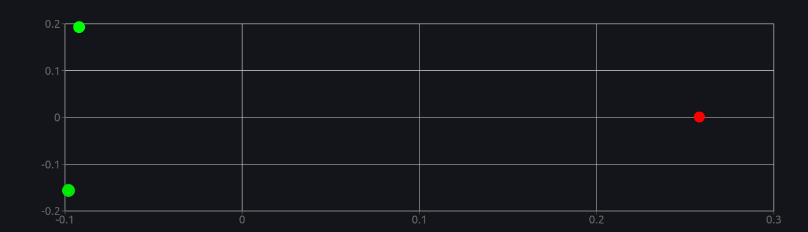
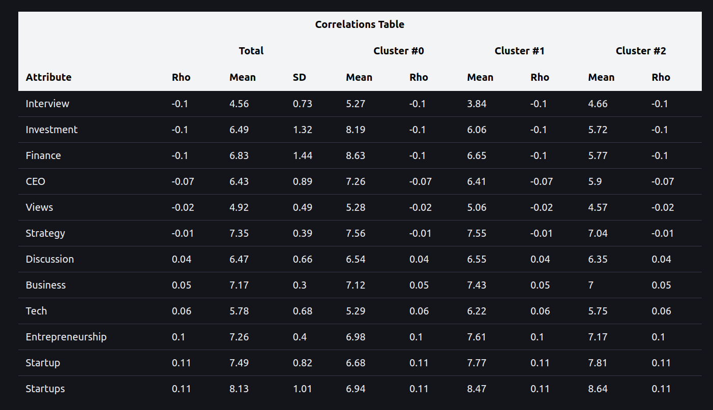
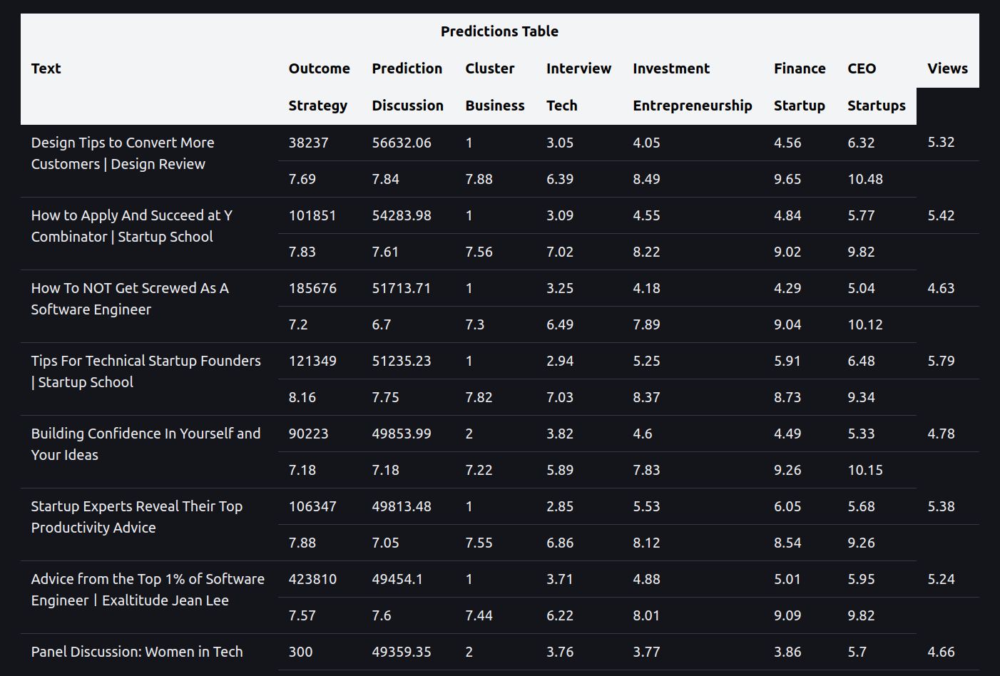
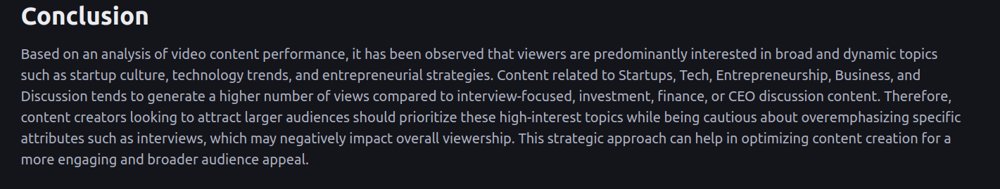
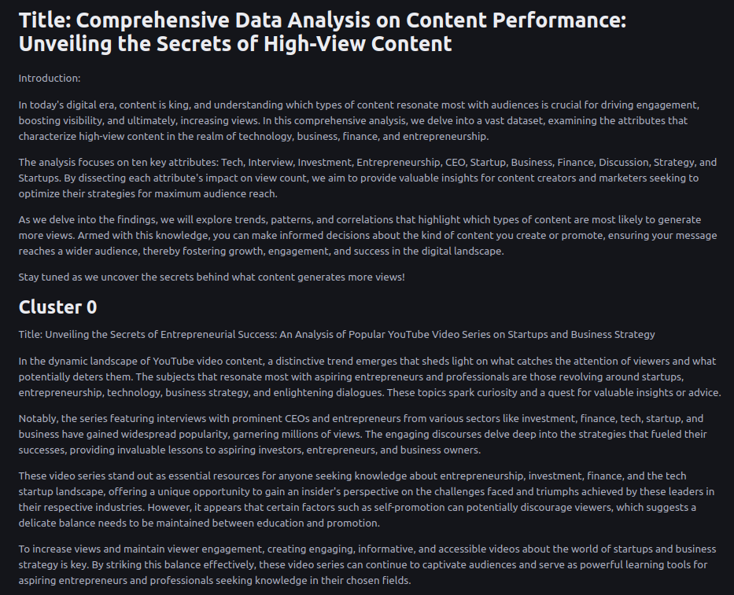
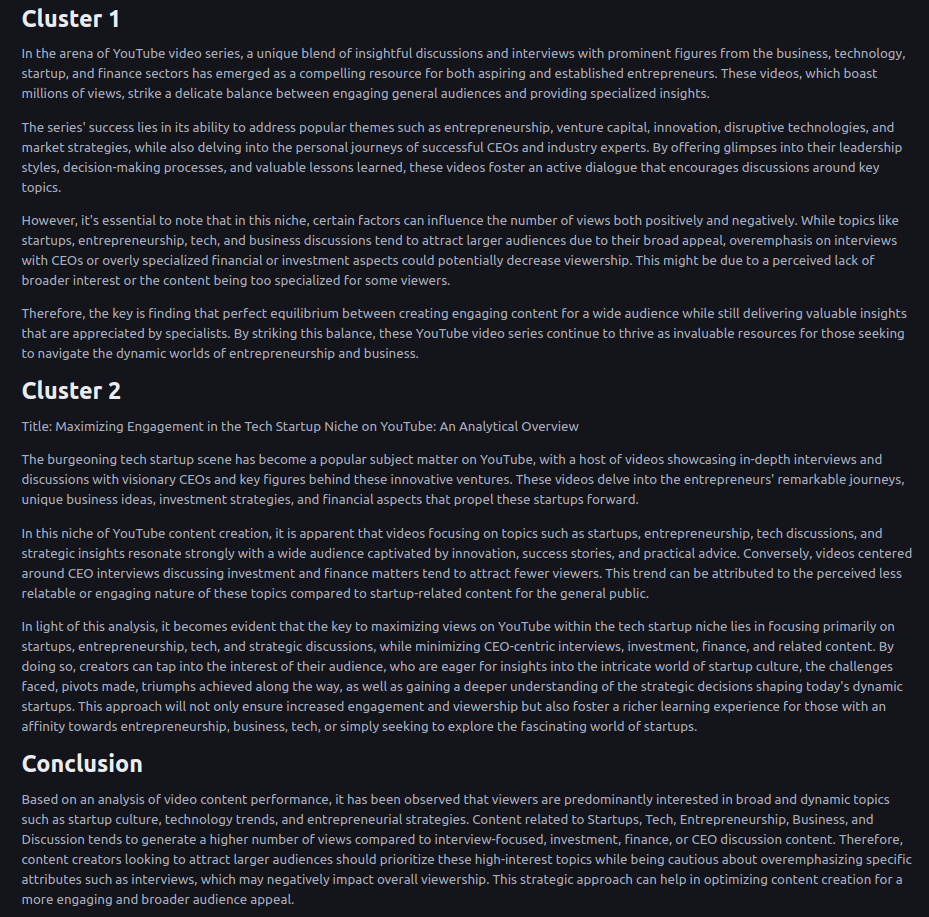

# BI-LLM Demo

Sample artifacts generated from an analysis on the causes of success in YouTube videos.

The data consisted of about 500 videos from 10+ channels in the startup niche.

You can read the report generated at [Report.pdf](./Report.pdf). I recommend focusing on the conclusion.

## Chart

The Chart component indicates the location of the clusters in a 2D-space.

Green shows above average performance, and red the contrary.

## Correlations

The table describes numerically the composition of the clusters. As well, as the attributes considered on the analysis.

## Predictions

A sample set of predictions from the videos. It indicates how videos are scored, and classified.

## Conclusion

The conclusion indicating viewers prefer content related to startups, and tech over interviews, finance, and managerial topics.

My conclusion is that people like to dream. Is easier for them to identify with an underdog story.

## Report

Full report. Some formatting is required, and will be focus of the next release.

