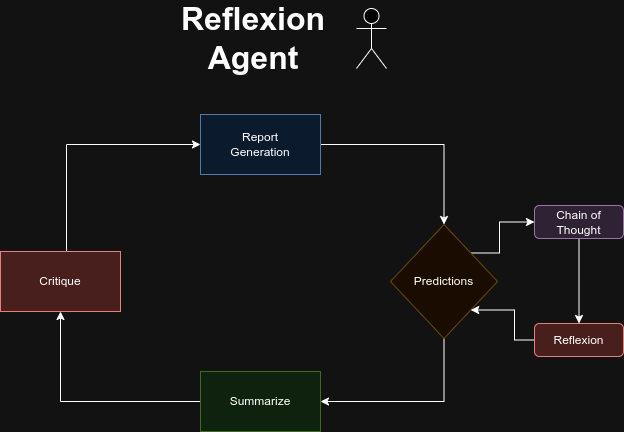

# Reflection Agent - Learning what to ask 

### Problem Statement

When writing a data analysis, it is required to dive deep into the data to understand what drives the outcome. For example, on the prescriptive section of a YouTube engagement analysis when indicating what type of content performs the best, it would be beneficial to nourish it with examples of channels that successfully create content on the proposed niche, and what combination of attributes they use, including some examples of successful titles. Today, there are pre-engineering prompts but those need to be selected, and run manually. Not only is this a slow, non-scalable process, but it makes it difficult to store, aggregate, and summarize the outputs. 

Technically, the model would need to understand what questions to ask, and ideally, later how to retrieve the data. The problem can be stated as an undefined dimensional space where there are multiple possible directions, collapsed in a single direction. As such, first the latent space would need to be mapped, and prioritized. Initially, the solution would be used exclusively for human reading reports, but ideally it can be leveraged to improve the performance of predictions. Feeding a summarized version of the report for making predictions. Then, the reflection agent should be able to look at the predictions, and detect what can be improved on the summary. As stated, the results would be evaluated across 4 dimensions: accuracy, neutrality, anomaly detection, and consistency.

The analysis will be performed on short content that has the benefit of faster outputs cycles, transcripts being more relevant, and engagement metrics easier to aggregate. It is unclear, however, if titles will be relevant, and the role of comments. The analysis on short content will also make progress for multi-view learning by enabling the comparison of engagement between short-form, and long-form content. The end result of a good reflection agent would be to create the data, hypothesis, and predictions to understand what drives likes from comments. Making it easy to reproduce viral content.

### Proposed solution

The reflection agent, should be able to go uninterrupted for 10-30 minutes/questions to gather insights from data. It should be able to identify how well the content is performing, and which questions are required to understand the causal relationships of viewer engagement. There are two possible approaches: formulate all the questions at the start, or iteratively formulate the next question. For simplicity it will start by formulating all the questions at the start, as it is easier to evaluate the answers. The second challenge is given a question formulate a query to retrieve the data. This could be accomplished by selecting one of the available prompts, and filling the necessary values.

To ground the questions, is necessary to pair them with predictions. This would create a simple multi-agent system, where Reflection sits at the center of an information pipeline after a prediction agent, a report generation agent, a summarization agent, and an evaluation agent. Predictions gives a path to evaluate what a good question looks like, it also opens the possibility to more general purpose questions like understanding the performance of a given attribute across channels, or selecting between possible growth directions. Not every LLM output will be used for making predictions. Thus, a PromptStore will be required to manually look at the answers or later use a RAG to enhance reports, predictions or even question answering. it would be interesting to make some progress on mapping the embedding space of questions, as a future possibility to evaluate what questions to ask.

The final outcome is a second version of the marketable report. Just as the first one, it will be divided in 3 sections: content insights, niche analysis, and growth opportunities. The main benefit is that after this second version the report will be partially automated, and hopefully with additional information from the autonomous LLM requests, and a bit more structure from the evaluation, reflection, and prediction agents. The ideal state would be that the first two sections of the report are partially automated, with the final version of the report backed by data. The third section will still be mostly manually written but with insights from LLM outputs. For now, progress on incorporating comments, transcripts, or benchmark metrics is not expected. However, it would be interesting if there can be progress enabling the Reflection agent to perform its own LLM queries, and retrieve data independently. Maybe it could be the start to teach the agent SQL.    

### Development roadmap

- [x] Retrieve shorts content from API (expand to last 200 videos).
- [x] Automate report generation, and predictions.
- [x] Evaluation of predictions across 4 accuracy metrics.
- [x] Reflection: propose questions to improve accuracy.
- [ ] Data retrieval: map questions to LLM prompts.
- [ ] Summary & consolidation: improve report based on answers.
- [ ] Engagement questions: compare engagement across channels.
- [ ] PromptStore: database to store LLM outputs.
- [ ] Enable self-prompting, or even self-data retrieval by Reflection. 
- [ ] Final output: marketable report for 20VC channel on short content.

### Reflexion pipeline

1. Test the new report.
2. Evaluate the accuracy.
3. Decide to use the new report or not.
4. Go next cycle.
